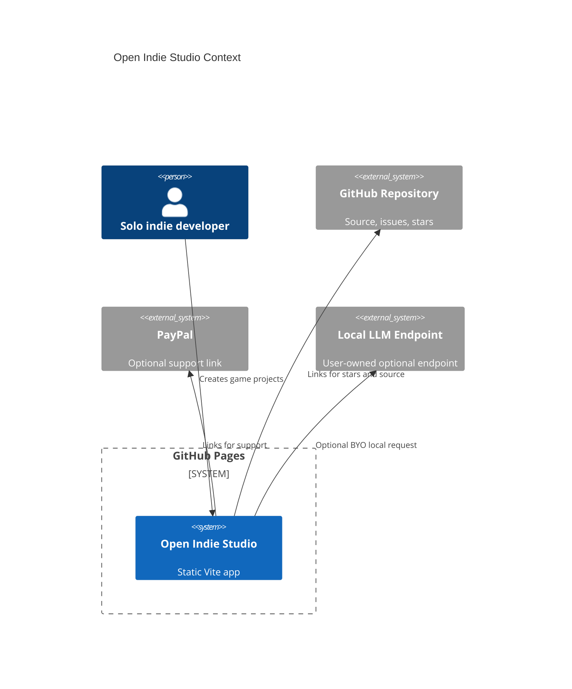

# Open Indie Studio

[](https://baditaflorin.github.io/open-indie-studio/)
[](LICENSE)

Open Indie Studio is a browser-based toolkit for making, testing, packaging, and documenting small 2D/casual indie games.

Live site: https://baditaflorin.github.io/open-indie-studio/

Repository: https://github.com/baditaflorin/open-indie-studio

Support: https://www.paypal.com/paypalme/florinbadita

## Quickstart

```bash
npm install
make install-hooks
make dev
make test
make build
```

## What It Does

- Builds a small playable 2D scene entirely in the browser.
- Persists project state locally with IndexedDB.
- Lazy-loads heavier modules such as Three.js, Tone.js, and Yjs behind user actions.
- Exports a static playtest HTML file and a Pandoc-ready design brief.
- Shows the deployed version and source commit on the GitHub Pages UI.

## Architecture



More detail: docs/architecture.md

ADRs: docs/adr/

Deployment guide: docs/deploy.md

Privacy: docs/privacy.md

## GitHub Pages

The app is Mode A: Pure GitHub Pages. The production build lands in `docs/` and Pages serves the `main` branch from `/docs`.

## Checks

```bash
make lint
make test
make build
make smoke
```

No GitHub Actions are used. Local git hooks are installed with `make install-hooks`.
