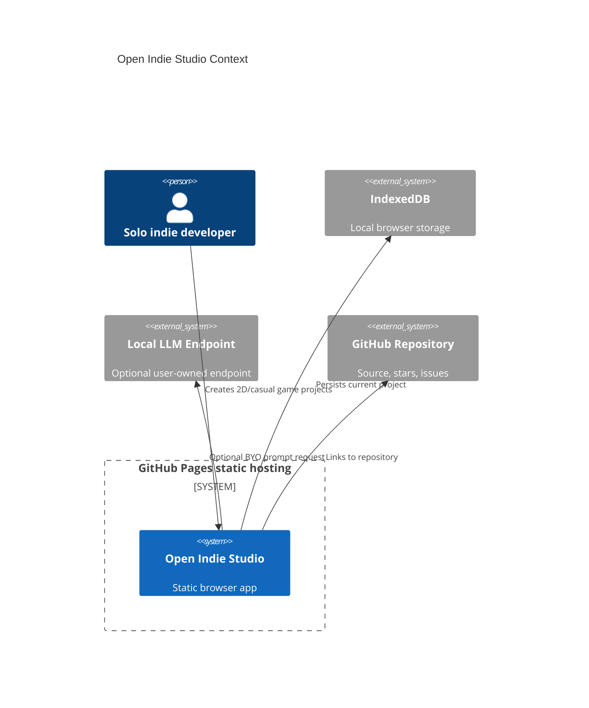
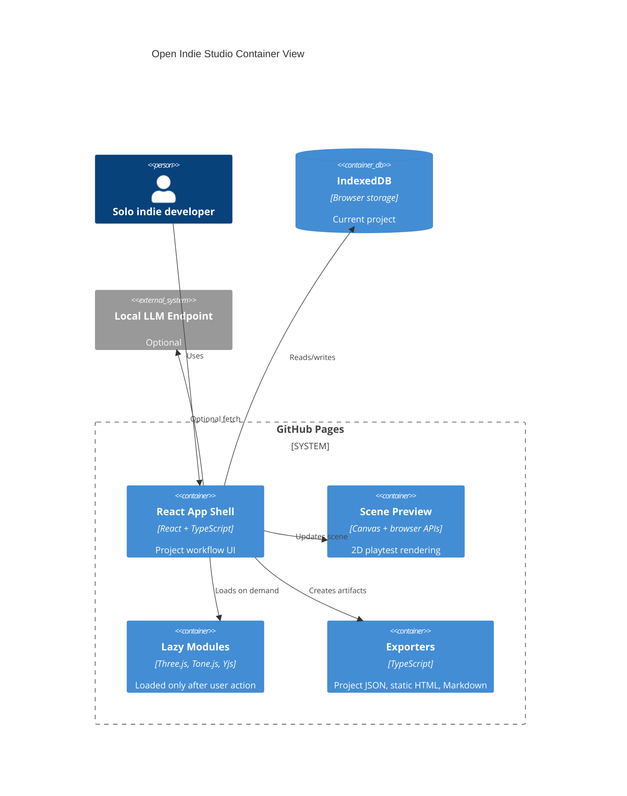

# Architecture

Open Indie Studio is Mode A: Pure GitHub Pages.

Live URL: https://baditaflorin.github.io/open-indie-studio/

Repository: https://github.com/baditaflorin/open-indie-studio

## Context

## Container

## Module Boundaries

- `src/features/studio/`: project data, storage, and the primary workflow.
- `src/features/audio/`: Web Audio and Tone.js sketches.
- `src/features/rendering/`: canvas and Three.js preview support.
- `src/features/export/`: portable artifacts.
- `src/features/ai/`: local LLM client.
